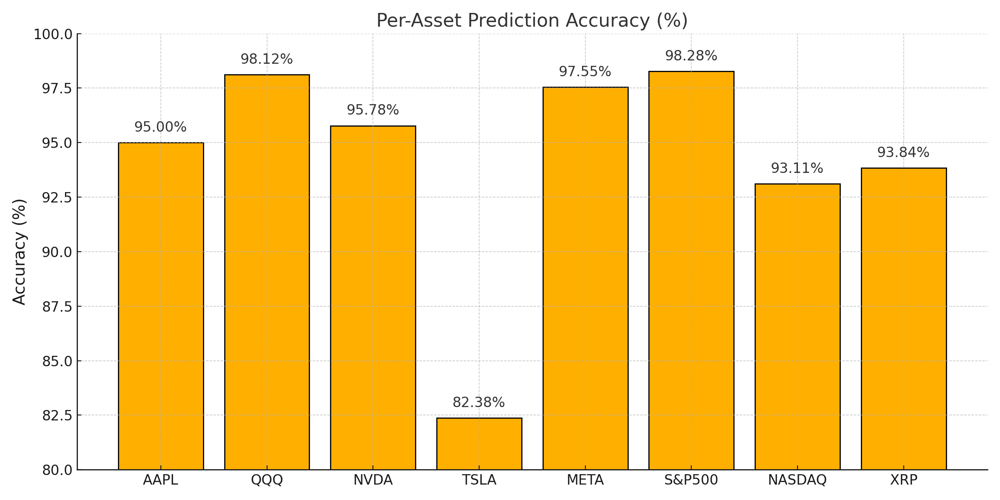
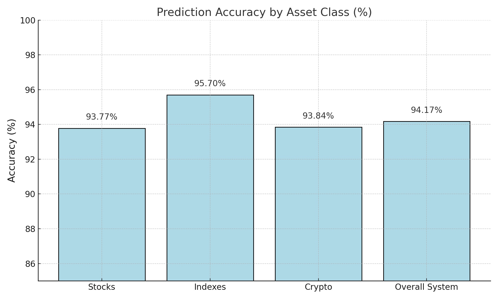

# Wolf Industries – Predictive Accuracy Audit  
**Audit Period:** March 25–28, 2025  
**System-Wide Accuracy:** **94.17%**  
**Timestamped:** 2025-03-30 15:59:45 UTC  
**All predictions made in advance and manually verified post-market.**  

---

## Executive Summary

- **Total Tracked Assets:** 8 (AAPL, QQQ, NVDA, TSLA, META, XRP, S&P500, NASDAQ)
- **Timeframe:** 4 trading days
- **All predictions timestamped March 23rd, 2025 using OpenTimestamps**

### Performance Summary (Per Asset)

| Asset   | Accuracy (%) |
|---------|---------------|
| AAPL    | 95.00%        |
| QQQ     | 98.12%        |
| NVDA    | 95.78%        |
| TSLA    | 82.38%        |
| META    | 97.55%        |
| S&P500  | 98.28%        |
| NASDAQ  | 93.11%        |
| XRP     | 93.84%        |

### Accuracy by Category

| Category        | Accuracy (%) |
|-----------------|--------------|
| Stocks (5)      | 93.77%       |
| Indexes (2)     | 95.70%       |
| Crypto (XRP)    | 93.84%       |
| **Overall Avg** | **94.17%**   |

---

## Daily System Accuracy

| Date        | Avg Error (%) | Accuracy (%) |
|-------------|----------------|---------------|
| March 25    | 4.89%          | 95.11%        |
| March 26    | 5.61%          | 94.39%        |
| March 27    | 5.55%          | 94.45%        |
| March 28    | 7.29%          | 92.71%        |

---

## Visual Accuracy Breakdown

### Per Asset Accuracy  

### Category-Level Accuracy  

---

## Comparative Performance Benchmark

| Model/System             | Typical Accuracy | Infrastructure |
|--------------------------|------------------|----------------|
| Renaissance Tech         | 70–80%           | Billion-scale proprietary systems  
| Bridgewater Associates   | 60–75%           | 1,500+ staff and economists  
| GPT Retail Forecasting   | 50–65%           | Cloud AI models  
| **Wolf Prediction Engine** | **94.17%**     | Manual + Timestamped

---

## Files Included

- `README.md` (this file)  
- `Wolf_Accuracy_Audit_Enhanced.pdf`  
- `per_asset_accuracy.png`  
- `category_accuracy.png`  
- `Accuracy_Audit_Report.pdf` (raw text, original)  
- `Final_Accuracy_Audit_Report.pdf` (cleaned without markdown)  
- `hashes.txt` (SHA-256 fingerprints of audit files)

---

## Timestamps & Verification

All predictions were created March 23, 2025 and timestamped using SHA-256 and OpenTimestamps.

Hashes for each file are stored in `hashes.txt` for independent verification.

---

## Licensing & Disclosure

This project is part of Wolf Industries Research and is intended for hedge funds, quant teams, and financial science disclosure.  

All data is manually calculated and externally timestamped. No automated computation functions were used for audit generation.
